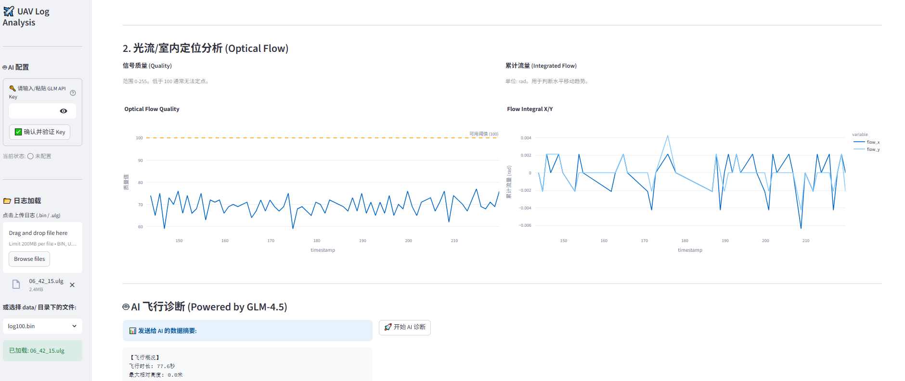

# 🚁 UAV Insight Toolkit (AI-Powered)


**UAV Insight Toolkit** is a comprehensive, open-source telemetry analysis and visualization platform designed for PX4 and ArduPilot drones. Built with Python, Pymavlink, and PyULog, it bridges the gap between raw binary logs and actionable flight insights.

> **Core Value:** Provides engineers with an interactive dashboard to diagnose vibration issues, PID performance, and 3D flight trajectories instantly—now powered by **GLM-4.5 AI** for automated diagnostics.

## 📸 Dashboard Preview




## ✨ Key Features

### 📡 Dual-Stack Support (ArduPilot & PX4)

* **Auto-Detection:** Seamlessly handles **ArduPilot `.bin`** and **PX4 `.ulg`** logs. The system automatically selects the appropriate parser based on file extension.
* **Unified Interface:** Standardizes data from different firmwares (MavLink vs. ULog) into a unified analysis pipeline.

### 🤖 AI Smart Diagnostics (AI Copilot)

* **Powered by GLM-4.5:** Integrated with ZhipuAI's latest Large Language Model via `zai-sdk` for real-time inference.
* **Time-Series Analysis:** Automatically downsamples flight logs to extract vibration peaks, altitude shifts, and attitude errors, generating a context-aware diagnostic report.
* **One-Click Checkup:** Automatically identifies issues like "Frame Resonance," "PID Oscillation," and "Sensor Clipping."

### 👁️ Optical Flow & Indoor Navigation

* **GPS-Denied Trajectory:** Automatically visualizes **Local Position (NED)** trajectories when GPS is unavailable, perfect for indoor flight analysis.
* **Flow Analytics:** Dedicated charts for Optical Flow quality and integrated flow (rad), helping to diagnose "toilet bowl effect" or position drift issues.

### 🔧 PID Tuning Analysis (Rate Controller)

* **Desired vs. Actual:** Overlays **Desired Rate** (Red) and **Actual Rate** (Blue) curves for Roll, Pitch, and Yaw axes.
* **Quantified Metrics:** Automatically calculates Mean Absolute Error (MAE) to quantify tracking performance.

### 📊 Multi-Dimensional Visualization

* **Interactive 3D Replay:** Visualizes flight paths with relative altitude encoding using Plotly 3D engines.
* **Vibration & Clipping:** * **ArduPilot:** Visualizes `VIBE` message data.
  * **PX4:** Automatically calculates vibration levels (Rolling Std Dev) from high-frequency IMU data and detects accel clipping events.

### ⚡ Modern Engineering Experience

* **Drag & Drop Upload:** Supports direct file uploads via the web UI or local scanning of the `data/` directory (EXE compatible).
* **Secure Configuration:** Built-in API Key validation with secure storage (session-based or local file), ensuring keys are never exposed.

## 🛠️ Tech Stack

* **Core Parsing:** * `pymavlink` (for ArduPilot `.bin`)
  * `pyulog` (for PX4 `.ulg`)
* **AI Engine:** ZhipuAI GLM-4.5-Flash (via `zai-sdk`)
* **Data Processing:** Pandas (Time-series alignment, merge_asof & forward-fill algorithms)
* **Visualization:** Streamlit (Web UI), Plotly (Interactive Charts)

## 🚀 Quick Start

### 1. Installation

```bash
# Clone the repository
git clone [https://github.com/Tartistbz/UAV-Insight-Toolkit.git](https://github.com/Tartistbz/UAV-Insight-Toolkit.git)
cd UAV-Insight-Toolkit

# Create virtual environment (Recommended)
conda create -n uav-env python=3.9
conda activate uav-env

# Install dependencies
pip install -r requirements.txt
```

### 2. AI Configuration (Optional)

To use the AI Diagnostics feature, you need a ZhipuAI API Key.

1. Get your key from the [ZhipuAI Open Platform](https://bigmodel.cn/).
2. **Method A (GUI):** Enter the key in the sidebar and click "Verify".
3. **Method B (File):** Create a file named `apikey.txt` in the root directory and paste your key there (this file is Git-ignored).

### 3. Usage

Run the dashboard:

Bash

```
streamlit run src/app.py
```

The app will launch at `http://localhost:8501`. You can then drag and drop your `.bin` or `.ulg` log files to start analysis.

## 📂 Project Structure

Plaintext

```
UAV-Insight-Toolkit/
├── data/               # Log storage (Git-ignored)
├── src/
│   ├── analyzer/       # Core Parsing Logic
│   │   ├── parser_base.py   # Abstract Base Class
│   │   ├── ardu_parser.py   # ArduPilot Implementation
│   │   └── px4_parser.py    # PX4 Implementation (New)
│   └── app.py          # Streamlit Dashboard Entry
├── requirements.txt    # Dependency Management
└── README.md           # Documentation
```

## 📝 Roadmap

- [x] Basic .bin Log Parsing
- [x] Attitude & 3D Trajectory Visualization
- [x] Vibration Level Diagnostics & Clipping Detection
- [x] **PID Analysis (Rate Roll/Pitch/Yaw)**
- [x] **AI Smart Diagnostics (GLM-4.5 Integration)**
- [x] File Upload & EXE Path Compatibility
- [x] **PX4 .ulg Support (with Optical Flow & Local Pos)**
- [ ] Export to CSV/MAT format

## 🤝 Contribution

Contributions are welcome! Please fork the repository and submit a Pull Request.

## 📄 License

Distributed under the GNU General Public License v3.0. See `LICENSE` for more information.