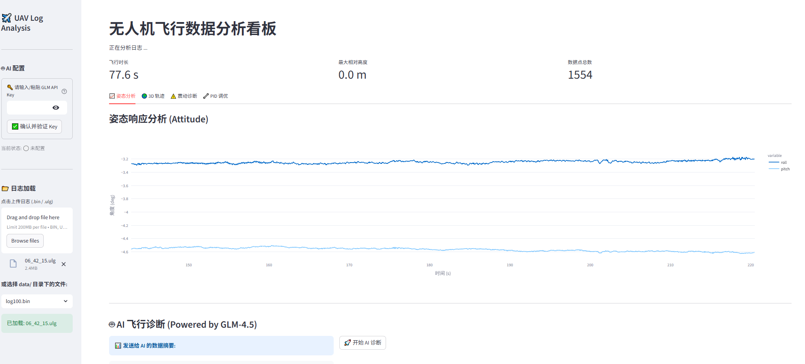

# 🚁 UAV Insight Toolkit


**UAV Insight Toolkit** is a comprehensive, open-source telemetry analysis and visualization platform designed for PX4 and ArduPilot drones. Built with Python and MAVLink, it bridges the gap between raw binary logs and actionable flight insights.

> **Core Value:** Provides engineers with an interactive dashboard to diagnose vibration issues, PID performance, and 3D flight trajectories instantly.

## ✨ Key Features

* **📊 Multi-Format Parsing:** * Supports ArduPilot `.bin` binary logs (via `pymavlink`).
  * Extensible architecture designed for PX4 `.ulg` support.
* **🌍 Interactive 3D Replay:** * Visualizes flight paths with relative altitude encoding using Plotly 3D engines.
* **⚠️ Automated Diagnostics:** * **Vibration Analysis:** Auto-detects dangerous vibration levels (>30m/s²) and sensor clipping events.
  * **Attitude Response:** Overlays Roll/Pitch setpoints vs. actual response (in development).
* **⚡ Real-time Ready:** * Modular design separates the Data Layer from the Presentation Layer, ready for real-time telemetry integration.

## 🛠️ Tech Stack

* **Core Logic:** Python 3.9, Pymavlink (MAVLink Protocol Handling)
* **Data Processing:** Pandas (Time-series alignment & forward-fill algorithms)
* **Visualization:** Streamlit (Web UI), Plotly (Interactive Charts)
* **Design Pattern:** Strategy Pattern (for parser extensibility)

## 🚀 Quick Start

### 1. Installation

```bash
# Clone the repository
git clone [https://github.com/Tartistbz/UAV-Insight-Toolkit.git](https://github.com/Tartistbz/UAV-Insight-Toolkit.git)
cd UAV-Insight-Toolkit

# Create virtual environment (Recommended)
conda create -n uav-env python=3.9
conda activate uav-env

# Install dependencies
pip install -r requirements.txt
```

### 2. Usage

Place your log files (`.bin`) into the `data/` directory, then run:

Bash

```
streamlit run src/app.py
```

The dashboard will automatically launch in your browser at `http://localhost:8501`.

## 📂 Project Structure

Plaintext

```
UAV-Insight-Toolkit/
├── data/               # Log storage (Git-ignored)
├── src/
│   ├── analyzer/       # Core Parsing Logic
│   │   ├── parser_base.py   # Abstract Base Class
│   │   └── ardu_parser.py   # ArduPilot Implementation
│   └── app.py          # Streamlit Dashboard Entry
├── requirements.txt    # Dependency Management
└── README.md           # Documentation
```

## 📝 Roadmap

- [x] Basic .bin Log Parsing
- [x] Attitude & 3D Trajectory Visualization
- [x] Vibration Level Diagnostics & Clipping Detection
- [ ] PID Analysis (Rate Roll/Pitch)
- [ ] Export to CSV/MAT format
- [ ] PX4 .ulg Support


## 🤝 Contribution

Contributions are welcome! Please fork the repository and submit a Pull Request.

## 📄 License

Distributed under the GNU General Public License v3.0. See `LICENSE` for more information.

## 📸 Dashboard Preview

